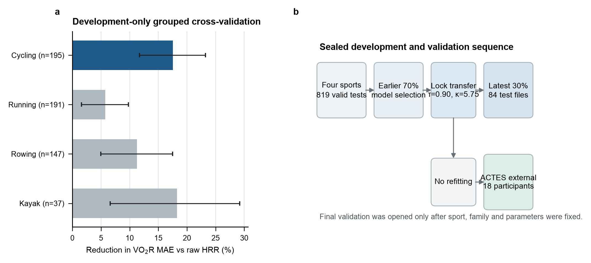
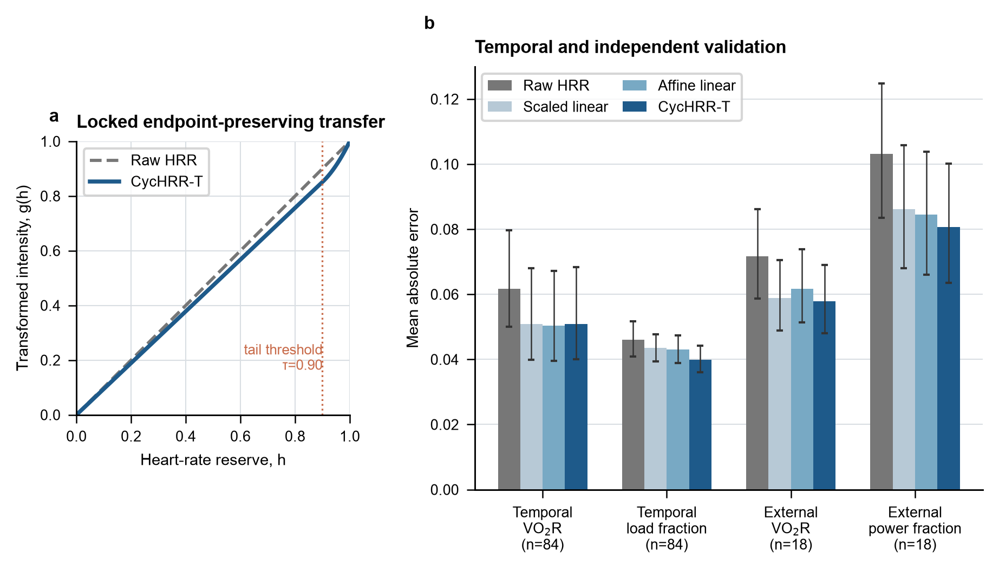
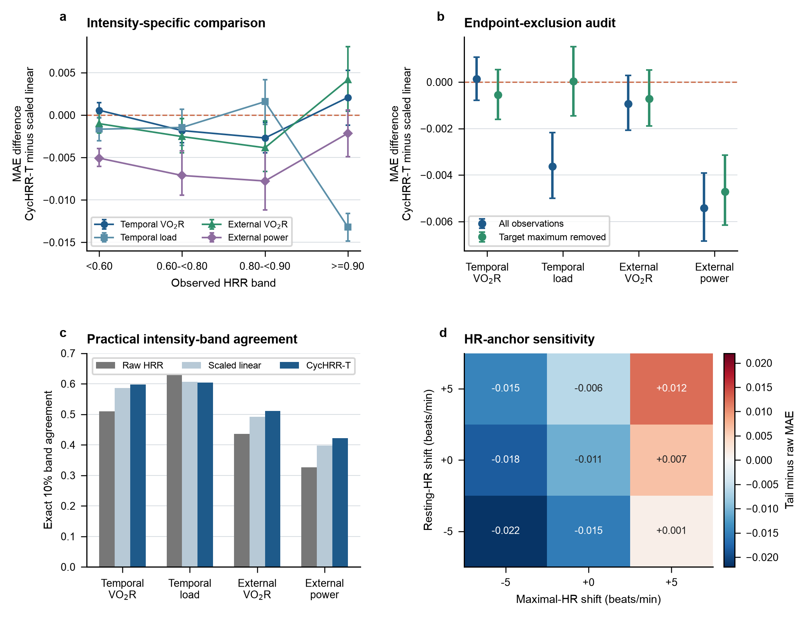

# Calibration of Heart-Rate Reserve for Graded Cycle Ergometry: An Endpoint-Preserving Transfer Evaluated Against Linear Alternatives

**Running title:** Endpoint-preserving HRR calibration

**Author:** BoTao Cai

**Affiliation:** College of Physical Education, Jimei University, Xiamen, Fujian, China

**Corresponding author:** BoTao Cai, xcai2004xcai@gmail.com

**ORCID:** 0009-0002-3662-4539

## Abstract

### Background

Heart-rate reserve (HRR) is commonly treated as interchangeable with oxygen-uptake reserve (VO2R). We tested whether a bounded group calibration improves graded cycling-intensity estimation and whether any benefit requires nonlinearity.

### Methods

Two public datasets were analyzed. Development used 819 valid graded test files across cycling, running, rowing, and kayaking; the latest 30% within sport were withheld. Candidate mappings were compared by grouped five-fold cross-validation. A cycle-ergometry transfer was locked: g(h) = [h + 5.75 max(h - 0.90, 0)^2]/1.0575, with h clipped to 0-1. Primary VO2R mean absolute error (MAE) was evaluated in 84 temporal-holdout cycling files against raw HRR and development-fitted linear calibration. External task transport used 18 ACTES participants. Robustness analyses examined intensity bands, endpoint removal, 10% band agreement, timing offsets, parameters, and HR anchors. Paired bootstrap resampling used complete files or participants.

### Results

Temporal VO2R MAE decreased from 0.0617 to 0.0510 versus raw HRR, an absolute reduction of 1.07 percentage points (difference -0.0107, 95% confidence interval -0.0153 to -0.0060). Exact 10% VO2R-band agreement increased from 50.9% to 59.7%. MAE did not differ clearly from scaled-linear (0.0508) or affine-linear calibration (0.0504). Removing each test's maximum VO2R observation retained the benefit versus raw HRR, but not a clear difference from scaled linear. The transfer was better than scaled linear at 0.60-<0.90 HRR, but not at >=0.90 HRR. In ACTES, VO2R MAE decreased from 0.0717 to 0.0579 and power-fraction MAE from 0.1032 to 0.0807 versus raw HRR. Results were sensitive to HRmax specification.

### Conclusions

The transfer improved uncalibrated HRR but did not establish general nonlinear superiority over fitted linear calibration. It is an endpoint-preserving group calibration, not a validated training-load score; field and decision-level value require prospective evaluation.

**Keywords:** graded cycle ergometry; heart-rate reserve; oxygen-uptake reserve; exercise intensity; calibration; external task validation; open data

## 1. Introduction

Heart rate is one of the most accessible physiological signals in exercise monitoring. Consumer devices have extended its availability from laboratory tests to daily activity, but signal acquisition and physiological interpretation are separate measurement problems. Device error varies by activity and intensity, while the conversion from heart rate to metabolic or mechanical intensity introduces additional uncertainty [1-3]. A useful method should therefore state both what the sensor measures and how that signal is transformed.

The INTERLIVE Network synthesized evidence on free-living heart-rate assessment and proposed a transparent activity score based on individualized HRR [1]. Observations are allocated to 10% HRR clusters, after which the proportion of time in each cluster is weighted by cluster rank. This structure is reproducible and device-agnostic. Its intensity weighting is nevertheless linear: a one-cluster increase receives the same increment regardless of exercise mode or position within the intensity range.

The conventional identity mapping between HRR and VO2R originates from evidence that HRR more closely reflects VO2R than percentage of maximal oxygen uptake [4]. Cycling studies also support HRR as a useful relative-intensity anchor [5]. Later work has shown that HRR and VO2R are not universally interchangeable, with disagreement varying by exercise mode, intensity, duration, and anchor definition [6-9]. Oxygen uptake can also depart from a simple linear relation with external power at high work rates [10]. These findings support calibration, but they do not by themselves establish that a nonlinear function is superior to a fitted linear alternative.

Individual and mode-specific calibration is preferable when paired physiological reference data are available. For example, individual HR-energy-expenditure calibration improved high-intensity running and cycling estimates compared with group equations [14]. In many practical settings, however, individual indirect calorimetry is unavailable. A fixed group mapping may then be useful if it is transparent, bounded, and accompanied by a clear comparison with simpler alternatives. Such a mapping should be presented as a compromise, not as a replacement for individual calibration.

Cycle ergometry provides a controlled setting in which to examine this problem. Work rate is directly prescribed, stages are sustained, and metabolic and mechanical reference variables can be synchronized with heart rate. This setting does not reproduce road cycling, intermittent field exercise, or free-living behavior. It does, however, permit a focused test of whether a fixed HRR transformation improves concurrent relative-intensity estimation.

The primary aim was to develop and evaluate a fixed HRR calibration for graded cycle ergometry without using final validation data during model selection. The primary hypothesis was that a locked endpoint-preserving transfer would reduce complete-test VO2R MAE relative to the uncalibrated identity mapping. Secondary aims were to compare the transfer with development-fitted scaled and affine linear calibration, evaluate normalized mechanical workload, retain compatibility with 10% HRR bands, test transport to an independent laboratory cycling task, and quantify sensitivity to endpoint coupling, intensity range, HR kinetics, parameter choice, and HR anchors. We did not test fatigue, recovery, adaptation, injury, clinical outcomes, or the accuracy of wrist photoplethysmography.

## 2. Methods

### 2.1 Study design and analysis hierarchy

This was a secondary, exploratory methods-development study using public, deidentified exercise-test data. The workflow separated sport-direction screening, model development, temporal validation, and external task validation (Figure 1). Within each sport, the latest 30% of dated test files were labelled as holdout before model comparison. Direction, functional-family, and parameter decisions used only the earlier 70%. The temporal cycling holdout was opened after the sport, mapping family, parameters, primary target, and primary metric had been locked. This lock was documented internally but was not an externally timestamped preregistration. The study is therefore described as exploratory development with held-out validation rather than confirmatory validation.

The complete graded test file was the analysis unit in the multi-sport dataset. The public source does not provide a stable participant identifier across files, so repeated tests by the same person and participant overlap between development and temporal holdout cannot be determined. We consequently avoid calling the 84 holdout files 84 independent participants. All stages from a test remained in the same cross-validation fold, and test-level errors were averaged with equal weight. In ACTES, the participant was the analysis and resampling unit.

Five safeguards were used against optimistic performance estimates. First, stage rows were never treated as independent replicates. Second, all candidate sports received the same preprocessing and model grid. Third, linear comparators were fitted only in cycling development data and transferred without updating. Fourth, the final ACTES evaluation used the locked cycling-mode parameters. Fifth, all robustness analyses retained the locked function and were labelled post hoc unless part of the original core analysis. Code, split labels, processed tables, and figure source data accompany the manuscript.

### 2.2 Public datasets

#### 2.2.1 Multi-sport graded incremental test dataset

The development and temporal-validation source was Graded Incremental Test Data, version 2 [11]. It contains 835 anonymized cycling, running, rowing, and kayaking test files collected during exercise-testing services. The source record reports ethics approval, consent, medical screening, and compliance with the Declaration of Helsinki [11]. Cycling tests used an electromagnetically braked ergometer with 3-minute stages, continuous telemetry heart rate, metabolic measurement, and controlled work rate as described by the source investigators.

Files were eligible when the sport was supported, at least four active stages remained, resting and maximal HR differed by at least 40 beats/min, resting and maximal oxygen uptake differed by at least 10 mL/kg/min, and maximal workload exceeded baseline workload. Stage rows required heart rate, oxygen uptake, and workload. Derived HRR and VO2R values had to lie between -0.10 and 1.15, and workload fraction between 0 and 1.001. Sixteen files were excluded, leaving 819 test files and 6,230 active-stage observations: 280 cycling, 274 running, 211 rowing, and 54 kayaking. One valid cycling file without a test date was excluded from chronological splitting.

For each file, the lowest recorded workload defined baseline. Baseline HR and oxygen uptake were taken from that row. Maximal HR and oxygen uptake were the greater of the reported and observed stage maxima. Workload fraction was baseline-corrected. The derived quantities were

h = (HR - HR0)/(HRmax - HR0),

v = (VO2 - VO20)/(VO2max - VO20),

and

p = (P - P0)/(Pmax - P0).

Operational predictions were clipped to 0-1. Cycling development files were dated 1999-2008 and included 195 test files (161 male and 34 female records; age 29.2 +/- 6.7 years). The temporal holdout comprised 84 files dated 2008-2013 (66 male and 18 female records; age 31.7 +/- 8.8 years). Sex and age describe test records because participant identity across files is unavailable.

The source files identify stage order and a nominal 3-minute cycling-stage protocol. They do not provide a uniform, analysis-ready field indicating the exact within-stage window used for every summarized HR and VO2 value. A transition-window exclusion could therefore not be applied consistently to this dataset. This limitation was addressed by intensity-band, endpoint-exclusion, and external time-offset analyses rather than by claiming steady-state sampling for every stage.

#### 2.2.2 ACTES external dataset

External task validation used ACTES Cardiorespiratory Measurement from Graded Cycloergometer Exercise Testing, version 1.0.0 [12]. It contains synchronized RR intervals, oxygen uptake, and power from maximal graded cycle-ergometer tests in 18 athletes aged 12-18 years (10 fencing, 6 kayaking, and 2 triathlon participants). The test mode was cycling regardless of primary sport. The source reports deidentification, informed consent, and approval by the Comité de Protection des Personnes Sud-Ouest et Outre-Mer III [12].

RR intervals were converted to HR as 60,000/RR in milliseconds. Pre-exercise zero-power observations provided median baseline HR and oxygen uptake. Active records were aggregated into non-overlapping 10-second bins using medians. Observed active maxima provided HRmax, VO2max, and Pmax. Zero-power bins were excluded, and the same plausibility range was applied to HRR and VO2R. The processed dataset contained 1,541 active bins from all 18 participants.

### 2.3 Candidate mappings and sport-direction selection

Within each sport, dated test files were sorted chronologically and by file identifier. The earlier floor(70%) formed development data; the remaining dated files formed holdout data. Five development folds were assigned deterministically from a hash of file name. Model selection minimized the mean of complete-test stage MAEs, giving every test file equal weight.

Six mappings from HRR fraction h to target fraction were compared: raw identity, scaled linear through the origin, affine linear, power, normalized exponential, and normalized quadratic-tail. The power grid used exponents 0.40-2.50 in steps of 0.02. The exponential grid used k from -3.00 to 3.00 in steps of 0.05. The tail grid crossed threshold tau from 0.40 to 0.95 in steps of 0.05 with curvature kappa from 0 to 20 in steps of 0.25. The primary development target was VO2R; workload fraction was secondary.

Kayaking had the largest relative development-only improvement among nonlinear families but only 37 development files and no suitable external cycling-mode dataset. Cycling had 195 development files, a 17.5% cross-validated VO2R MAE reduction for the selected tail family versus raw HRR, and an external cycle-ergometry dataset. Cycling was therefore chosen for the locked evaluation. Four of five folds selected tau=0.90 with kappa 5.75-6.00; one selected the search boundary tau=0.95 and kappa=20. The modal values tau=0.90 and kappa=5.75 were locked. This boundary solution was retained as evidence of selection uncertainty.

### 2.4 Locked endpoint-preserving transfer

For h clipped to [0,1], the cycle-ergometry-derived HRR transfer (CycHRR-T) was

g(h) = [h + kappa max(h - tau, 0)^2]/[1 + kappa(1 - tau)^2],

with tau=0.90 and kappa=5.75. Therefore,

g(h) = [h + 5.75 max(h - 0.90, 0)^2]/1.0575.

The denominator fixes g(1)=1, while clipping defines the operational domain. Below 0.90 HRR, g(h)=h/1.0575, which is a fixed proportional downscaling with slope 0.9456. Above 0.90, the quadratic term progressively returns the mapping to the shared endpoint. The function is bounded, monotonic, and never exceeds raw HRR. The 0.90 threshold is a development-selected engineering parameter, not an established physiological breakpoint.

For compatibility with the INTERLIVE proposal, a quantized implementation replaced each HRR value with the midpoint of its 10% band (0.05, 0.15, ..., 0.95) before applying g(h). Continuous HRR remained the primary representation. For implementation only, time-resolved values may be summarized as the duration-weighted mean of g(h). Multiplying this mean by duration yields an exposure descriptor. Neither aggregation was validated against perceived exertion, recovery, adaptation, performance, illness, or injury; they are therefore not named or presented as validated training-load scores.

### 2.5 Comparators, outcomes, and robustness analyses

The primary outcome was VO2R MAE in the 84 temporally held-out cycling test files. Absolute stage error was averaged within file and then across files. The paired contrast was CycHRR-T minus comparator MAE, so negative values favored CycHRR-T. A percentile 95% CI was calculated by resampling complete test files 10,000 times. A two-sided sign-flip test with 100,000 permutations provided a distribution-light paired check for the raw-HRR comparison. Win count was the number of analysis units with lower MAE under CycHRR-T.

Secondary outcomes were temporal-holdout workload fraction, quantized estimates, ACTES VO2R, and ACTES power fraction. Root mean square error, mean bias, calibration intercept, slope, and R2 were descriptive. Secondary p values were not multiplicity-adjusted and were treated as descriptive.

Scaled-linear and affine-linear comparators were fitted with equal-test weighting in cycling development data. The continuous VO2R comparator parameters were scale=0.9563 and intercept/slope=0.0417/0.9025. The workload parameters were scale=0.9610 and intercept/slope=-0.0114/0.9757. These parameters were transferred unchanged to the temporal holdout. Development VO2R parameters were used for ACTES VO2R, and workload parameters for ACTES power fraction.

Robustness analyses retained the locked parameters. First, errors were stratified by observed HRR: <0.60, 0.60-<0.80, 0.80-<0.90, and >=0.90. Complete units contributed equally within each band, and the number of units and observations was reported. Second, each unit's maximum target observation was removed to assess endpoint coupling; a separate analysis excluded HRR >=0.95. Third, target and prediction values were assigned to 10% bands. Exact agreement, agreement within one band, and absolute band error were averaged within complete units. These bands are measurement categories, not validated prescription zones.

Fourth, ACTES HRR was offset from criterion variables by -30 to +30 seconds in 10-second steps without refitting. Positive values paired a later HR-derived estimate with the current criterion observation. This sensitivity analysis examined ranking stability under plausible synchronization and kinetic mismatch; it was not used to choose an offset. Fifth, eight nearby or fold-motivated parameter pairs were applied post hoc to both validation datasets. Sixth, baseline HR and HRmax were perturbed by -5, 0, or +5 beats/min in the temporal holdout while the physiological target remained fixed. All analyses used deterministic scripts and seed 20260808.

## 3. Results

### 3.1 Development and locked model

Figure 1 summarizes the data separation and direction screening. Development-only reductions in VO2R MAE for the best nonlinear family versus raw HRR were 18.3% in kayaking, 17.5% in cycling, 11.3% in rowing, and 5.7% in running. Cycling was selected because it combined a comparatively large development sample, an untouched temporal holdout, and an external graded cycling dataset. This selection reflects feasibility and validation depth; it does not prove that the parameters are physiologically specific to cycling.

Within cycling development data, VO2R MAE was 0.0512 for raw HRR, 0.0426 for scaled linear, 0.0429 for affine linear, and 0.0422 for the selected tail family. Workload-fraction MAE was 0.0463, 0.0428, 0.0425, and 0.0367, respectively. These estimates informed selection and are not reported as final performance.

### 3.2 Primary temporal validation against raw HRR

In the temporal holdout, continuous CycHRR-T reduced complete-test VO2R MAE from 0.0617 to 0.0510 (Table 2). The paired difference was -0.0107 (95% CI -0.0153 to -0.0060), equivalent to 1.07 percentage points on the reserve scale and a 17.4% relative reduction. CycHRR-T had lower MAE in 57 of 84 test files; the sign-flip p value was 0.00004. RMSE decreased from 0.1014 to 0.0918, and mean bias from 0.0395 to 0.0074. Calibration R2 changed little (0.802 to 0.807).

Workload-fraction MAE decreased from 0.0461 to 0.0399 (difference -0.0063, 95% CI -0.0108 to -0.0015), an absolute reduction of 0.63 percentage points and a 13.6% relative reduction. The 10-band implementation retained smaller improvements: VO2R MAE decreased from 0.0656 to 0.0582 and workload MAE from 0.0576 to 0.0517.

### 3.3 Strong linear comparators and endpoint coupling

The transfer did not provide clear incremental accuracy over fitted linear calibration for the primary outcome. Temporal VO2R MAE was 0.0508 for scaled linear, 0.0504 for affine linear, and 0.0510 for CycHRR-T. Paired differences were 0.00014 (95% CI -0.00077 to 0.00106) versus scaled linear and 0.00053 (95% CI -0.00134 to 0.00245) versus affine linear.

Against raw HRR, removing each test's maximum VO2R observation did not abolish the temporal benefit: MAE was 0.0647 for raw HRR and 0.0529 for CycHRR-T (difference -0.0117, 95% CI -0.0169 to -0.0064). The same restricted analysis gave 0.0535 for scaled linear, with no clear difference from CycHRR-T (difference -0.00056, 95% CI -0.00160 to 0.00053). For temporal workload, the full-data advantage over scaled linear was -0.00363 (95% CI -0.00500 to -0.00218), but after removing each test's maximum workload observation it was 0.00003 (95% CI -0.00145 to 0.00152). Thus, the mechanical advantage over scaled linear depended substantially on endpoint-containing observations, whereas the improvement over raw HRR did not.

In ACTES, removing each participant's maximum target observation retained improvements over raw HRR for VO2R (-0.0141, 95% CI -0.0200 to -0.0076) and power fraction (-0.0241, 95% CI -0.0282 to -0.0194). The power advantage over scaled linear also remained (-0.00472, 95% CI -0.00615 to -0.00314).

### 3.4 Intensity-specific performance

Performance varied across the function's segments (Figure 3A; Table 4). In temporal VO2R, CycHRR-T was better than scaled linear at 0.60-<0.80 HRR (difference -0.00183, 95% CI -0.00325 to -0.00040) and 0.80-<0.90 HRR (-0.00270, 95% CI -0.00446 to -0.00089). At >=0.90 HRR, the difference favored scaled linear numerically (0.00208, 95% CI -0.00118 to 0.00528). ACTES VO2R showed the same pattern: differences favored CycHRR-T at 0.60-<0.80 and 0.80-<0.90, but favored scaled linear at >=0.90 (0.00416, 95% CI 0.00048 to 0.00806).

Mechanical targets differed. In temporal workload, CycHRR-T was substantially better than scaled linear at >=0.90 HRR (-0.01319, 95% CI -0.01484 to -0.01157), but this contrast was strongly influenced by maximum-workload observations. In external power, CycHRR-T was better than scaled linear below 0.90 HRR, with differences from -0.00507 to -0.00777, while the >=0.90 difference was -0.00215 (95% CI -0.00488 to 0.00062). These results do not support a general claim that the quadratic tail improves high-intensity metabolic estimation.

### 3.5 Practical 10% intensity-band agreement

For temporal VO2R, exact 10% band agreement increased from 50.9% under raw HRR to 59.7% under CycHRR-T, a paired increase of 8.8 percentage points (95% CI 2.6 to 14.8). Agreement within one band increased from 93.9% to 96.3%. CycHRR-T and scaled linear had similar exact agreement (59.7% versus 58.6%; difference 1.1 percentage points, 95% CI -0.7 to 2.9). For temporal workload, exact agreement was 62.9% for raw HRR and 60.4% for CycHRR-T, with an inconclusive paired difference; agreement within one band increased from 97.7% to 98.9%.

In ACTES, exact agreement increased from 43.6% to 51.1% for VO2R and from 32.6% to 42.2% for power fraction. CycHRR-T exceeded scaled linear by 2.0 percentage points for external VO2R exact agreement (95% CI 0.9 to 3.1) and by 2.4 percentage points for power (95% CI 0.8 to 4.2). These changes describe measurement-category agreement. They do not establish that a training decision, clinical threshold, or athlete outcome would change.

### 3.6 External transport, time offsets, parameter alternatives, and HR anchors

Transferred without refitting, CycHRR-T reduced ACTES participant-level VO2R MAE from 0.0717 to 0.0579 versus raw HRR (difference -0.0138, 95% CI -0.0194 to -0.0072; 15/18 wins). Power-fraction MAE decreased from 0.1032 to 0.0807 (difference -0.0225, 95% CI -0.0264 to -0.0180; 17/18 wins). The absolute improvements were 1.38 and 2.25 percentage points. Compared with fitted linear models, CycHRR-T was similar to scaled linear for external VO2R, lower than affine linear for external VO2R, and lower than both linear alternatives for external power.

Across ACTES HR-alignment offsets from -30 to +30 seconds, CycHRR-T remained better than raw HRR for both targets. Its difference from scaled linear ranged from 0.00011 to -0.00143 for VO2R and from -0.00331 to -0.00565 for power. Absolute MAE varied with offset, indicating that synchronization and kinetics affect calibration, but the broad model ranking was stable.

Post hoc parameter sensitivity showed a flat local region for temporal VO2R: MAE was 0.0510 for the locked pair (0.90, 5.75), 0.0511 for (0.90, 8), 0.0510 for (0.85, 3), and 0.0510 for the fold-boundary pair (0.95, 20). External power varied more substantially across parameter pairs. These findings reduce confidence that tau=0.90 and kappa=5.75 are uniquely identified physiological constants.

HR-anchor perturbation materially changed inference (Figure 3D). Increasing HRmax by 5 beats/min reversed the mean temporal VO2R contrast versus raw HRR when baseline HR was unchanged (difference 0.0065). Increasing both baseline and maximal HR by 5 beats/min produced a difference of 0.0122. Resting-HR perturbations alone changed magnitude more than direction. Reliable HR anchors are therefore an application requirement.

## 4. Discussion

### 4.1 Principal interpretation

This study developed a one-line, endpoint-preserving HRR transfer and evaluated it under a deliberately demanding comparison hierarchy. The locked mapping improved the uncalibrated identity relation in a temporal cycling holdout and in an external laboratory cycling task. Absolute improvements were modest, approximately 0.6-2.3 percentage points of the normalized criterion scale, but they were accompanied by improved 10% VO2R-band agreement and consistent participant-level external power results.

The main conclusion is not that nonlinearity is generally superior. A development-fitted scaled or affine linear calibration matched the transfer for primary temporal VO2R, and intensity-stratified analyses did not show a high-intensity VO2R benefit from the quadratic tail. Several nearby parameter pairs performed similarly. CycHRR-T is therefore best understood as a fixed group calibration with two engineering properties: it is monotonic and it preserves the maximal endpoint. Those properties may be useful when an application requires a shared 0-1 scale, but they are not evidence of a universal 90% HRR threshold.

### 4.2 Relation to previous work

The HRR-VO2R equivalence remains a valuable approximation for exercise prescription [4,5]. Its limitations are also well documented [6-9]. Our findings reconcile these positions: raw HRR captured much of the criterion variation, while a small group-level calibration reduced systematic positive bias. The low-intensity slope of CycHRR-T was 0.9456, close to the development-fitted VO2R scale factor of 0.9563. Most of the metabolic gain can therefore be attributed to proportional calibration rather than the quadratic tail itself.

Individual calibration remains the stronger option when reference data are available. Klass and colleagues found that individual HR-energy-expenditure calibration improved high-intensity cycling and running estimates relative to group calibration [14]. CycHRR-T addresses a different use case: a fixed, auditable mapping when individual indirect calorimetry is unavailable. It should not be presented as a substitute for participant-specific HR-VO2, HR-power, or multivariable calibration.

The mechanical results require additional care. Normalized power is external workload, whereas HR and VO2 are internal responses [13]. Full-data mechanical advantages partly reflected endpoint preservation and target normalization. The external power benefit persisted after removal of each participant's target maximum, but temporal workload superiority over scaled linear did not. This contrast is informative because it shows where the formula's apparent advantage is robust and where it is tied to the evaluation geometry.

### 4.3 Practical meaning

The formula is easy to implement and audit. A practitioner with defensible resting and cycling maximal HR can compute HRR, clip it to 0-1, and apply g(h). Continuous values should be retained when available. The 10% representation is appropriate when a system stores only band durations, but it introduces quantization error.

The observed 10% band changes provide an interpretable effect benchmark. Exact temporal VO2R-band agreement improved by 8.8 percentage points versus raw HRR, while external improvements were 7.6 points for VO2R and 9.6 points for power. Yet exact temporal workload agreement did not improve. No minimum important calibration difference has been established for these normalized outcomes, and no outcome-based training zones were studied. The practical conclusion must therefore remain at the measurement level.

The initial use case is descriptive profiling of graded or sustained cycling intensity when individual calibration is unavailable. CycHRR-T should not drive return-to-play, medication, clinical thresholds, or automated training prescription. Field deployment with wrist photoplethysmography also requires separate validation of the sensor layer [2,3]. A validated ECG-derived source or chest strap is the more defensible first application.

Duration-weighted transformed intensity can be summarized for software implementation, but equal averages can conceal very different intensity distributions. A steady moderate session and an alternating low-high session may have the same mean. Multiplying by duration adds exposure but does not create evidence of training dose. These summaries should remain descriptive until validated against perceived exertion, recovery, adaptation, or performance.

### 4.4 Strengths and limitations

The evidence chain has several strengths. The direction was screened across four sports. Final cycling files were withheld during selection. Complete files and participants, rather than stage rows, were resampling units. Strong linear alternatives were fitted in development data and transferred unchanged. The external dataset differed in laboratory, sampling structure, and participant age. The analysis now includes endpoint removal, intensity stratification, practical band agreement, time-offset sensitivity, parameter alternatives, and anchor perturbation. All favorable and unfavorable results are retained in machine-readable tables.

The limitations define the manuscript's scope. First, stable participant identifiers are absent from the graded-test dataset. Residual dependence and participant overlap across files are unknowable, so confidence intervals may be too narrow if the same individuals contributed repeatedly. Second, the chronological split also introduced demographic and procedural drift. It is a useful stress test but cannot isolate the cause of performance change.

Third, the formula family, sport direction, and parameter grid were researcher-selected. One development fold reached the search boundary, several nearby parameter sets performed similarly, and validation intervals condition on the selected workflow. The analyses do not include full selection uncertainty. Fourth, target variables were normalized within test or participant. This makes cross-unit comparison possible but mechanically anchors maxima near one. Endpoint-exclusion results show that some workload advantages depend on those observations.

Fifth, the exact within-stage averaging window could not be standardized from the available graded-test files. HR kinetics may therefore contribute to stage mismatch. The ACTES offset analysis showed ranking stability over +/-30 seconds but cannot reproduce transition exclusion in the historical dataset. Sixth, ACTES included only 18 adolescent athletes whose primary sports were fencing, kayaking, or triathlon. It validates transport to another graded cycling task, not generalization to adult specialist cyclists.

Finally, both sources were controlled laboratory tests. The model was not evaluated during road cycling, intervals with recovery, prolonged drift, heat, dehydration, altitude, medication-altered HR, or free-living activity. It was not tested against fatigue, perceived exertion, recovery, adaptation, performance, illness, injury, or clinical outcomes. Wrist-wearable accuracy was not studied.

### 4.5 Future validation

A prospective study should preregister the formula and comparison hierarchy, enroll independent participants, and use participant-level development and test splits. Synchronized ECG or validated chest-strap HR, breath-by-breath VO2, crank power, cadence, and explicit stage-transition markers should be collected during graded tests, steady-state bouts, and intervals. Women, older adults, recreational riders, and trained cyclists should be adequately represented.

The primary comparison should include raw HRR, CycHRR-T, group scaled linear, group affine linear, individual linear calibration, and a flexible monotonic calibration. Decision thresholds should be defined before analysis. Reporting should include continuous error, calibration, 10% band agreement, intensity-specific performance, and test-retest reliability. Only a subsequent outcome study should evaluate duration-weighted summaries against session perceived exertion, recovery, adaptation, or performance.

## 5. Conclusion

CycHRR-T improved concurrent VO2R and normalized workload estimation relative to uncalibrated HRR in temporally held-out and external graded cycle-ergometry data. The absolute gain was modest but accompanied by better VO2R intensity-band agreement. The transfer did not consistently outperform development-fitted linear calibration, and its quadratic tail did not show general high-intensity metabolic superiority. It is therefore an endpoint-preserving group calibration for further validation, not a validated nonlinear training-load or clinical score.

## Declarations

### Ethics statement

No new participants were recruited and no new human data were collected. Only public, deidentified datasets were analyzed. The original data records report their respective ethics approvals and consent procedures [11,12]. No separate institutional ethics review or written exemption determination was obtained for this secondary analysis.

### Consent for publication

Not applicable. No identifiable participant information is reported.

### Funding

This research received no external funding.

### Competing interests

The author declares no competing interests.

### Author contributions

BoTao Cai: conceptualization, methodology, software, formal analysis, investigation, data curation, visualization, writing of the original draft, review and editing, and project administration.

### Data availability

Graded Incremental Test Data are available from Zenodo at https://doi.org/10.5281/zenodo.10841412 under CC BY 4.0 [11]. ACTES version 1.0.0 is available from PhysioNet at https://doi.org/10.13026/2qs3-kh43 under the PhysioNet Open Data Commons Attribution License [12]. Processed audit tables, unit-level results, robustness analyses, and figure source data are included in the accompanying results workbook and repository. No new participant-level data were generated.

### Code availability

Analysis code, deterministic split labels, locked parameters, processed result tables, figure-generation code, and document builders are available at https://github.com/xcai66/Calibration-of-Heart-Rate-Reserve-for-Graded-Cycle-Ergometry. The archived v2.0.0 release is available at https://doi.org/10.5281/zenodo.21860652; future versions are maintained under the Zenodo concept DOI https://doi.org/10.5281/zenodo.21689574. ORCID: https://orcid.org/0009-0002-3662-4539.

### Use of generative artificial intelligence

A generative AI system was used for language editing, document organization, and code assistance. The author remains responsible for study decisions, source and reference verification, statistical interpretation, and the final manuscript.

## References

1. Schumann M, Feuerbacher JF, Heinrich L, Olvera-Rojas M, Sclafani A, Brond JC, et al. Using Free-Living Heart Rate Data as an Objective Method to Assess Physical Activity: A Scoping Review and Recommendations by the INTERLIVE-Network Targeting Consumer Wearables. Sports Med. 2025;55:275-300. doi:10.1007/s40279-024-02159-1.
2. Muhlen JM, Stang J, Lykke Skovgaard E, Judice PB, Molina-Garcia P, Johnston W, et al. Recommendations for determining the validity of consumer wearable heart rate devices: expert statement and checklist of the INTERLIVE Network. Br J Sports Med. 2021;55:767-779. doi:10.1136/bjsports-2020-103148.
3. Zhang Y, Weaver RG, Armstrong B, Burkart S, Zhang S, Beets MW. Validity of wrist-worn photoplethysmography devices to measure heart rate: a systematic review and meta-analysis. J Sports Sci. 2020;38:2021-2034. doi:10.1080/02640414.2020.1767348.
4. Swain DP, Leutholtz BC. Heart rate reserve is equivalent to %VO2 reserve, not to %VO2max. Med Sci Sports Exerc. 1997;29:410-414. doi:10.1097/00005768-199703000-00018.
5. Lounana J, Campion F, Noakes TD, Medelli J. Relationship between %HRmax, %HR reserve, %VO2max, and %VO2 reserve in elite cyclists. Med Sci Sports Exerc. 2007;39:350-357. doi:10.1249/01.MSS.0000246996.63976.5F.
6. Ferri Marini C, Sisti D, Leon AS, Skinner JS, Sarzynski MA, Bouchard C, et al. HRR and VO2R Fractions Are Not Equivalent: Is It Time to Rethink Aerobic Exercise Prescription Methods? Med Sci Sports Exerc. 2021;53:174-182. doi:10.1249/MSS.0000000000002434.
7. Olsson KSE, Rosdahl H, Schantz P. Interchangeability and optimization of heart rate methods for estimating oxygen uptake in ergometer cycling, level treadmill walking and running. BMC Med Res Methodol. 2022;22:55. doi:10.1186/s12874-022-01524-w.
8. Cunha FA, Midgley AW, Monteiro WD, Campos FK, Farinatti PTV. The relationship between oxygen uptake reserve and heart rate reserve is affected by intensity and duration during aerobic exercise at constant work rate. Appl Physiol Nutr Metab. 2011;36:839-847. doi:10.1139/h11-100.
9. Ferri Marini C, Federici A, Skinner JS, Piccoli G, Stocchi V, Zoffoli L, et al. Effect of steady-state aerobic exercise intensity and duration on the relationship between reserves of heart rate and oxygen uptake. PeerJ. 2022;10:e13190. doi:10.7717/peerj.13190.
10. Zoladz JA, Duda K, Majerczak J. Oxygen uptake does not increase linearly at high power outputs during incremental exercise test in humans. Eur J Appl Physiol Occup Physiol. 1998;77:445-451. doi:10.1007/s004210050358.
11. Donne B, Fleming N, Campbell G, Ward T, Crampton D, Mahony N. Graded Incremental Test Data (Cycling, Running, Kayaking, Rowing): an open access dataset. Version 2. Zenodo; 2024. doi:10.5281/zenodo.10841412.
12. Chabert C, Mongin D, Hermand E, Collado A, Hue O. Cardiorespiratory measurement from graded cycloergometer exercise testing. Version 1.0.0. PhysioNet; 2022. doi:10.13026/2qs3-kh43.
13. Impellizzeri FM, Marcora SM, Coutts AJ. Internal and External Training Load: 15 Years On. Int J Sports Physiol Perform. 2019;14:270-273. doi:10.1123/ijspp.2018-0935.
14. Klass M, Faoro V, Carpentier A. Assessment of energy expenditure during high intensity cycling and running using a heart rate and activity monitor in young active adults. PLoS One. 2019;14:e0224948. doi:10.1371/journal.pone.0224948.

## Figure legends

**Figure 1. Development-only direction screening and analysis sequence.** Panel A shows development-only reductions in VO2R MAE for the best nonlinear family versus raw HRR. Points and 95% bootstrap CIs use complete test files as units: cycling n=195, running n=191, rowing n=147, and kayaking n=37. Panel B shows the locked sequence from 819 valid multi-sport test files to the 84-file cycling temporal holdout and the ACTES external task evaluation in 18 participants. Test files may not represent unique participants because stable cross-file identifiers were unavailable. Source data are provided in the results workbook.

**Figure 2. Locked endpoint-preserving transfer and comparator performance.** Panel A shows raw HRR and CycHRR-T across the operational domain. Panel B shows mean complete-unit MAE for raw HRR, development-fitted scaled and affine linear calibration, and CycHRR-T. Error bars are 95% bootstrap CIs. Temporal estimates use 84 complete test files; external estimates use 18 ACTES participants. The bootstrap resampling unit is the complete test file or participant, respectively. Source data are provided in the results workbook.

**Figure 3. Boundary, practical-agreement, and anchor robustness.** Panel A shows paired MAE differences between CycHRR-T and scaled linear calibration across observed HRR bands; negative values favor CycHRR-T. The temporal panels include 83-84 test files per band and the external panels 17-18 participants; exact counts and observations are reported in the source table. Panel B compares all observations with removal of each unit's maximum target observation. Panel C reports exact 10% target-band agreement for raw HRR, scaled linear calibration, and CycHRR-T in 84 test files or 18 participants. Panel D shows temporal VO2R MAE differences between CycHRR-T and raw HRR after +/-5 beats/min perturbations of resting and maximal HR. Complete test files or participants were the bootstrap units for panels A and B. Source data are provided in the results workbook.

## Main tables

**Table 1. Dataset allocation and analysis units.**

| Source | Role | Population/test mode | Analysis units | Resolution | Outcomes |
|---|---|---|---:|---|---|
| Graded Incremental Test Data | Direction and development | Multi-sport graded tests | 570 development test files | Stage | VO2R; workload fraction |
| Graded Incremental Test Data | Temporal validation | Graded cycle ergometry | 84 complete test files | Stage | VO2R; workload fraction |
| ACTES | External task validation | Athletes completing graded cycle ergometry | 18 participants | 10-second active bins | VO2R; power fraction |

**Table 2. Locked validation against raw HRR.**

| Dataset | Target | n | Raw HRR MAE | CycHRR-T MAE | Difference (95% CI) | Absolute change | Relative change | Wins |
|---|---|---:|---:|---:|---|---:|---:|---:|
| Temporal holdout | VO2R | 84 | 0.0617 | 0.0510 | -0.0107 (-0.0153 to -0.0060) | -1.07 points | -17.4% | 57 |
| Temporal holdout | Workload fraction | 84 | 0.0461 | 0.0399 | -0.0063 (-0.0108 to -0.0015) | -0.63 points | -13.6% | 54 |
| ACTES | VO2R | 18 | 0.0717 | 0.0579 | -0.0138 (-0.0194 to -0.0072) | -1.38 points | -19.2% | 15 |
| ACTES | Power fraction | 18 | 0.1032 | 0.0807 | -0.0225 (-0.0264 to -0.0180) | -2.25 points | -21.8% | 17 |

**Table 3. Strong linear comparators and endpoint-exclusion audit.**

| Dataset/target | Scenario | Comparator MAE | CycHRR-T MAE | CycHRR-T minus comparator (95% CI) | Interpretation |
|---|---|---:|---:|---|---|
| Temporal VO2R | All; scaled linear | 0.0508 | 0.0510 | 0.00014 (-0.00077 to 0.00106) | No clear difference |
| Temporal VO2R | Maximum target removed; scaled linear | 0.0535 | 0.0529 | -0.00056 (-0.00160 to 0.00053) | No clear difference |
| Temporal workload | All; scaled linear | 0.0435 | 0.0399 | -0.00363 (-0.00500 to -0.00218) | Favors CycHRR-T |
| Temporal workload | Maximum target removed; scaled linear | 0.0427 | 0.0427 | 0.00003 (-0.00145 to 0.00152) | No clear difference |
| External VO2R | All; scaled linear | 0.0588 | 0.0579 | -0.00093 (-0.00208 to 0.00029) | No clear difference |
| External power | All; scaled linear | 0.0862 | 0.0807 | -0.00542 (-0.00684 to -0.00391) | Favors CycHRR-T |
| External power | Maximum target removed; scaled linear | 0.0879 | 0.0832 | -0.00472 (-0.00615 to -0.00314) | Favors CycHRR-T |

**Table 4. Intensity-specific CycHRR-T comparison with scaled linear calibration.**

| Dataset/target | HRR band | Units/observations | Scaled MAE | CycHRR-T MAE | Difference (95% CI) |
|---|---|---|---:|---:|---|
| Temporal VO2R | <0.60 | 83/223 | 0.0504 | 0.0510 | 0.00057 (-0.00033 to 0.00147) |
| Temporal VO2R | 0.60-<0.80 | 84/184 | 0.0571 | 0.0552 | -0.00183 (-0.00325 to -0.00040) |
| Temporal VO2R | 0.80-<0.90 | 82/109 | 0.0554 | 0.0527 | -0.00270 (-0.00446 to -0.00089) |
| Temporal VO2R | >=0.90 | 84/166 | 0.0369 | 0.0389 | 0.00208 (-0.00118 to 0.00528) |
| External VO2R | <0.60 | 18/778 | 0.0550 | 0.0540 | -0.00101 (-0.00213 to 0.00017) |
| External VO2R | 0.60-<0.80 | 18/313 | 0.0540 | 0.0515 | -0.00253 (-0.00446 to -0.00043) |
| External VO2R | 0.80-<0.90 | 17/183 | 0.0743 | 0.0705 | -0.00385 (-0.00665 to -0.00067) |
| External VO2R | >=0.90 | 18/267 | 0.0667 | 0.0709 | 0.00416 (0.00048 to 0.00806) |
